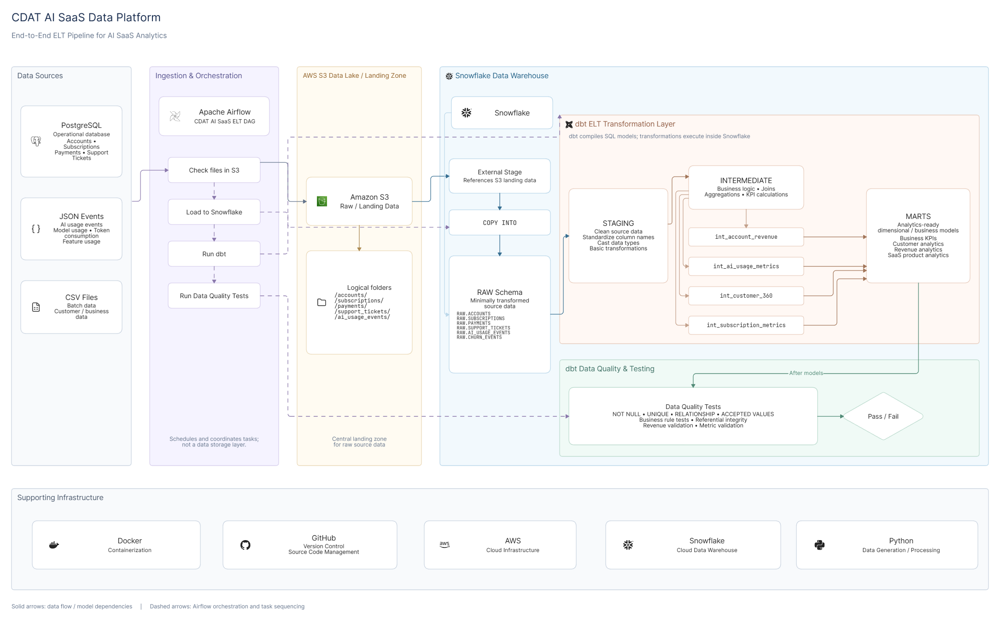

# CDAT AI SaaS Data Platform

An end-to-end **ELT pipeline** that turns raw SaaS operational data into an analytics-ready
star schema in Snowflake, orchestrated with Apache Airflow and transformed with dbt.



---

## Overview

SaaS teams accumulate operational data across many systems — billing, product telemetry,
support desks — and end up with reporting that is slow, inconsistent, and hard to trust.
This project builds the pipeline that fixes that: a repeatable flow that lands raw source
files in object storage, loads them into a cloud warehouse, transforms them through
modelled layers, and validates the result automatically on every run.

**The business question it answers:** *which customers are healthy, which are expanding,
and which are about to churn?* The marts layer answers this directly by combining
subscription movement (upgrade / downgrade / churn flags) with realised payment behaviour
and support experience per account.

### What this covers

| Domain | Contents |
|---|---|
| **Customers** | 10,000 accounts with industry, country, plan tier, referral source, trial and churn status |
| **Revenue** | 30,000 subscriptions and 797,797 payment records with status and method |
| **Product usage** | 500,000 AI inference events with token counts, latency, and success/failure status |
| **Support** | 100,000 support tickets with resolution time, first response time, and CSAT |

### Status

The pipeline has been run end-to-end. The most recent `dbt test` execution
(**2026-10-02**) passed **124 of 124 tests**, and `dbt docs generate` produced a
full catalog and lineage graph. See [Data quality](#data-quality--testing) and
[Known limitations](#known-limitations) for the honest current state.

---

## Architecture

```text
┌──────────────────────────┐
│  Source data (CSV / JSON)│
│  data/raw/               │
└────────────┬─────────────┘
             │  aws/s3/upload_to_s3.py
             ▼
┌──────────────────────────┐
│  Amazon S3  (landing)    │  s3://cdart-ai-saas-data-platform/raw/
│  partitioned by source   │  raw/postgres/…  raw/external/…  raw/events/…
└────────────┬─────────────┘
             │  COPY INTO  (Snowflake internal stage)
             ▼
┌──────────────────────────┐
│  Snowflake  ·  RAW       │  source-aligned tables, no transformation
└────────────┬─────────────┘
             │  dbt run
             ▼
┌──────────────────────────┐
│  dbt  ·  staging         │  5 views   — rename, cast, flatten JSON
│          ·  intermediate │  4 views   — business logic and aggregations
│          ·  marts        │  7 tables  — star schema for BI
└────────────┬─────────────┘
             │  dbt test
             ▼
┌──────────────────────────┐
│  Validated marts         │  dim_customer · dim_subscription ·
│  ready for BI            │  fact_payments · fact_support_tickets ·
│                          │  fact_ai_usage
└──────────────────────────┘
```

**Snowflake objects**

| Object | Name |
|---|---|
| Database | `cdart_ai_saas_platform_DW` |
| Warehouse | `cdart_ai_saas_platform` |
| Schemas | `RAW`, `STAGING`, `INTERMEDIATE`, `MARTS` |
| Internal stage | `RAW.cdart_ai_saas_platform_S3_STAGE` → `s3://cdart-ai-saas-data-platform/raw/` |
| File formats | `RAW.CSV_FORMAT` (skips header), `RAW.JSON_FORMAT` |

The custom `generate_schema_name` macro in `dbt/cdart_ai/macros/` keeps dbt's default
schema from being prefixed with the target schema, so models land in clean
`STAGING` / `INTERMEDIATE` / `MARTS` schemas rather than `RAW_STAGING`.

---

## Airflow orchestration

A single DAG drives the pipeline. Task graph:

```text
check_s3_files
      │
      ▼
load_s3_to_snowflake_raw
      │
      ▼
run_dbt_transformations
      │
      ▼
test_dbt_transformations
      │
      ▼
archive_s3_files
```

| Property | Value |
|---|---|
| DAG ID | `etelt_s3_snowflake_dbt_pipeline` |
| File | `airflow/dags/cdart_saas_pipleline.py` |
| Schedule | Manual trigger only (`schedule=None`) |
| Retries | 1, with a 2-minute delay |
| Failure handling | `on_failure_callback` placeholder hook |

**What each task does**

| Task | Operator | Responsibility |
|---|---|---|
| `check_s3_files` | `S3KeySensor` | Blocks until all five source prefixes have matching objects, using wildcard matching |
| `load_s3_to_snowflake_raw` | `SQLExecuteQueryOperator` | Runs five `COPY INTO` statements against the Snowflake stage — four CSV, one JSON |
| `run_dbt_transformations` | `BashOperator` | `dbt run --profiles-dir .` inside the mounted dbt project |
| `test_dbt_transformations` | `BashOperator` | `dbt test --profiles-dir .` — the pipeline fails if any check breaks |
| `archive_s3_files` | `BashOperator` | Placeholder for moving processed files to an archive prefix to guarantee idempotent reruns |

A second DAG, `hello_world_test`, is a smoke test that verifies the Airflow
installation itself is healthy.

The stack runs under the **CeleryExecutor** with Redis as broker and PostgreSQL for
Airflow metadata.

---

## Technology stack

| Technology | Version | Role |
|---|---|---|
| Python | 3.x | S3 upload and data generation scripts |
| Apache Airflow | 3.3.2 | Workflow orchestration |
| Celery + Redis | Redis 7.2 (bookworm) | Task execution and message broker |
| PostgreSQL | 16 | Airflow metadata database |
| dbt Core | 1.12.3 | SQL transformations, documentation, and data tests |
| dbt-snowflake | latest in image | dbt adapter for Snowflake |
| dbt_utils | `>=1.3.0` | Reusable test macros |
| Snowflake | Cloud | Cloud data warehouse |
| Amazon S3 | — | Raw data landing zone |
| Docker + Compose | — | Local runtime for Airflow and services |

Provider packages (`apache-airflow-providers-snowflake`, `apache-airflow-providers-amazon`)
and `dbt-snowflake` are installed in `airflow/Dockerfile`, so the image can run dbt and
talk to both S3 and Snowflake directly.

---

## Data sources

All sample data in this repository is **synthetic**. It contains no real customer
records, credentials, or personally identifiable information.

| Entity | File | Rows | Format | Origin | S3 prefix |
|---|---|---|---|---|---|
| Accounts | `data/source/source_accounts.csv` | 10,000 | CSV | PostgreSQL | `raw/postgres/accounts/` |
| Subscriptions | `data/source/source_subscriptions.csv` | 30,000 | CSV | PostgreSQL | `raw/postgres/subscriptions/` |
| Payments | `data/raw/source_payments.csv` | 797,797 | CSV | External billing | `raw/external/payments/` |
| Support tickets | `data/raw/source_support_tickets.csv` | 100,000 | CSV | External helpdesk | `raw/external/support_tickets/` |
| AI usage events | `data/raw/source_ai_usage_events.json` | 500,000 | JSON (one object per line) | Product events | `raw/events/ai_usage/` |

**S3 partition layout.** The CSV sources are partitioned by ingestion date and the event
source by year and month, so new loads never overwrite prior data:

```text
raw/postgres/accounts/ingestion_date=2026-10-03/accounts.csv
raw/external/payments/ingestion_date=2026-10-03/payments.csv
raw/events/ai_usage/year=2026/month=09/ai_usage_events.json
```

### Sample data

Two additional datasets are generated but not yet wired into the pipeline:

| Entity | File | Rows | Why it is unused |
|---|---|---|---|
| Churn events | `data/raw/source_churn_events.csv` | 3,000 | No RAW table, staging model, or `COPY INTO` statement exists yet |
| Feature usage | `data/raw/source_feature_usage.csv` | 2,000,000 | No RAW table or staging model yet |

They are ready to be modelled in a future iteration — see
[Future enhancements](#future-enhancements).

---

## Data model

### Layer summary

| Layer | Materialisation | Models | Purpose |
|---|---|---|---|
| `RAW` | Table | 5 | Source-aligned, loaded verbatim from S3 |
| `staging` | View | 5 | Rename, cast, and flatten the semi-structured JSON payload |
| `intermediate` | View | 4 | Business logic, joins, and per-entity aggregation |
| `marts` | Table | 7 | Conformed star schema for analytics |

### Staging models

Views that read straight from `RAW`. Most are pass-through; `stg_ai_usage_events` does the
real work of flattening the `VARIANT` column into typed columns.

| Model | Source | Notes |
|---|---|---|
| `stg_accounts` | `RAW.ACCOUNTS` | Pass-through |
| `stg_subscriptions` | `RAW.SUBSCRIPTIONS` | Pass-through |
| `stg_payments` | `RAW.PAYMENTS` | Pass-through |
| `stg_support_tickets` | `RAW.SUPPORT_TICKETS` | Pass-through |
| `stg_ai_usage_events` | `RAW.AI_USAGE_EVENTS` | Extracts 12 fields from the `VARIANT` JSON column and derives `total_tokens` |

### Intermediate models

Aggregations that encode business definitions, all materialised as views.

| Model | Grain | What it computes |
|---|---|---|
| `int_account_revenue` | One row per account | Subscription counts, active subscriptions, seats, MRR, ARR, upgrade/downgrade/churn counts, auto-renew count, plus revenue metrics (successful/failed counts, total and failed amounts, average payment) |
| `int_subscription_metrics` | One row per subscription | Subscription age in days, payment counts and totals, and account-level support metrics |
| `int_customer_360` | One row per account | A consolidated customer view: subscription, revenue, and support metrics in one record |
| `int_ai_usage_metrics` | One row per AI event | Normalised status, `is_success` / `is_failure` flags, event date and month, and `latency_per_token` |

The account-level metrics use `LEFT JOIN` with `COALESCE(..., 0)` so that accounts with no
subscriptions, payments, or tickets still appear with zeroed measures rather than dropping
out of the result.

### Marts — star schema

**Dimensions**

| Model | Key | Grain |
|---|---|---|
| `dim_customer` | `customer_key` (`account_id`) | One row per account |
| `dim_subscription` | `subscription_key` (`subscription_id`) | One row per subscription |
| `dim_ai_model` | `ai_model_key` (`model_name`) | One row per distinct model |
| `dim_feature` | `feature_key` (`feature_name`) | One row per distinct feature |

**Facts**

| Model | Key | Grain | Foreign keys |
|---|---|---|---|
| `fact_payments` | `payment_key` (`payment_id`) | One row per payment | `customer_key`, `subscription_key`, `date_key` |
| `fact_support_tickets` | `support_ticket_key` (`ticket_id`) | One row per support ticket | `customer_key`, `submitted_date_key`, `closed_date_key` |
| `fact_ai_usage` | `ai_usage_key` (`event_id`) | One row per AI inference event | `customer_key`, `subscription_key`, `date_key`, `ai_model_key`, `feature_key` |

```text
                    ┌──────────────────┐
                    │   dim_customer   │
                    └────────┬─────────┘
              ┌──────────────┼──────────────┐
              │              │              │
    ┌─────────▼──────┐  ┌────▼───────────┐  │
    │dim_subscription│  │ fact_ai_usage  │  │
    └─────────┬──────┘  └────┬───────────┘  │
              │              │              │
    ┌─────────▼──────┐  ┌────▼───────────┐  │
    │ fact_payments  │  │fact_support_...│  │
    └────────────────┘  └────────────────┘  │
                            │
                  ┌─────────┴─────────┐
          ┌───────▼──────┐   ┌───────▼──────┐
          │ dim_ai_model │   │ dim_feature  │
          └──────────────┘   └──────────────┘
```

**Relationship chain.** `ACCOUNTS` is the hub. `SUBSCRIPTIONS` belongs to an account;
`PAYMENTS` belongs to both an account and a subscription; `AI_USAGE_EVENTS` belong to an
account and a subscription and additionally reference an AI model and a product feature.
`SUPPORT_TICKETS` attach to an account.

> **Note on date keys.** The `date_key`, `submitted_date_key`, and `closed_date_key` columns
> currently hold native `DATE` values rather than surrogate integer keys, and there is no
> conformed date dimension yet. See [Known limitations](#known-limitations).

---

## Prerequisites

- **Docker** and **Docker Compose** (the Airflow stack requires at least 4 GB RAM and
  2 CPUs available to Docker)
- **Python 3.x** with `boto3` installed, to run the S3 upload script
- **dbt CLI** 1.12.x with the Snowflake adapter, to run dbt directly
- An **AWS account** with the `cdart-ai-saas-data-platform` bucket created
- A **Snowflake** account with permission to create a database, warehouse, and schemas
- **dbt profile credentials** — copy `.env.example` to `.env` and fill it in

> Run `dbt` and the S3 upload from your own machine, or use the Airflow containers.
> The commands below state the working directory for each step.

---

## Setup

### 1. Create the Snowflake objects

`snowflake/ddl/` contains the warehouse and database bootstrap scripts. Run them in
`dbt_project.yml` order in the Snowflake worksheet:

```sql
-- snowflake/ddl/create_warehouse.sql
CREATE WAREHOUSE IF NOT EXISTS cdart_ai_saas_platform
  WAREHOUSE_SIZE = 'XSMALL'
  AUTO_SUSPEND = 60
  INITIALLY_SUSPENDED = TRUE;

-- snowflake/ddl/create_database.sql
CREATE DATABASE IF NOT EXISTS cdart_ai_saas_platform_DW;
```

Then the schemas:

```sql
-- snowflake/ddl/create_schema.sql
CREATE SCHEMA IF NOT EXISTS cdart_ai_saas_platform_DW.RAW;
CREATE SCHEMA IF NOT EXISTS cdart_ai_saas_platform_DW.STAGING;
CREATE SCHEMA IF NOT EXISTS cdart_ai_saas_platform_DW.INTERMEDIATE;
CREATE SCHEMA IF NOT EXISTS cdart_ai_saas_platform_DW.MARTS;
```

The RAW tables:

```sql
-- snowflake/ddl/create_tables.sql  (5 tables)
-- ACCOUNTS, SUBSCRIPTIONS, SUPPORT_TICKETS, PAYMENTS, AI_USAGE_EVENTS
```

And the stage plus file formats:

```sql
-- snowflake/ddl/create_stage & format.sql
CREATE OR REPLACE FILE FORMAT cdart_ai_saas_platform_DW.RAW.CSV_FORMAT
  TYPE = CSV SKIP_HEADER = 1
  FIELD_OPTIONALLY_ENCLOSED_BY = '"'
  NULL_IF = ('NULL','null','') EMPTY_FIELD_AS_NULL = TRUE;

CREATE OR REPLACE FILE FORMAT cdart_ai_saas_platform_DW.RAW.JSON_FORMAT
  TYPE = JSON STRIP_OUTER_ARRAY = FALSE;

CREATE OR REPLACE STAGE cdart_ai_saas_platform_DW.RAW.cdart_ai_saas_platform_S3_STAGE
  URL = 's3://cdart-ai-saas-data-platform/raw/'
  STORAGE_INTEGRATION = s3_cdart_ai_saas_data_integration;
```

Verify the stage can see your objects:

```sql
LIST @cdart_ai_saas_platform_DW.RAW.cdart_ai_saas_platform_S3_STAGE;
```

### 2. Connect Snowflake to S3

`aws/iam/iam_policy.json` is a least-privilege read policy scoped to the bucket. Attach
it to the IAM role backing the `s3_cdart_ai_saas_data_integration` storage integration —
it grants `s3:GetObject` on `raw/*` and `s3:ListBucket` on the bucket, and nothing else.

### 3. Upload the sample data to S3

```bash
pip install boto3
aws configure          # or export AWS_ACCESS_KEY_ID / AWS_SECRET_ACCESS_KEY / AWS_DEFAULT_REGION
python aws/s3/upload_to_s3.py
```

The script reads from `data/source/` and `data/raw/` and writes to the partitioned
prefixes shown in [Data sources](#data-sources). Adjust the hardcoded paths at the top of
the script if your checkout lives elsewhere.

### 4. Configure dbt

Copy the example environment file and fill in your credentials:

```bash
cp airflow/.env.example airflow/.env
```

Then create `dbt/cdart_ai/profiles.yml` with your Snowflake account, user, and password.
Note that `profiles.yml` is listed in `.gitignore` because it holds credentials, so it
will not exist in a fresh clone — create it as part of setup. The project expects:

```yaml
cdart_ai:
  target: dev
  outputs:
    dev:
      type: snowflake
      account: <your_account>
      user: <your_user>
      password: <your_password>
      role: ACCOUNTADMIN
      database: cdart_ai_saas_platform_DW
      warehouse: cdart_ai_saas_platform
      schema: RAW
      threads: 4
```

### 5. Load S3 into Snowflake RAW

Either let the Airflow DAG do it (step 7), or run the statements directly:

```bash
# snowflake/copy_commands/copy_into_raw.sql
# Executes all five COPY INTO statements against the internal stage.
```

### 6. Run dbt

From the `dbt/cdart_ai` directory:

```bash
cd dbt/cdart_ai

dbt deps        # pulls dbt_utils
dbt debug       # verifies the Snowflake connection
dbt run         # builds 5 staging views, 4 intermediate views, 7 marts tables
dbt test        # runs the 124 checks
dbt docs generate   # builds the catalog and lineage site
```

Open the generated docs at `dbt/cdart_ai/target/index.html`.

To rebuild one layer, use a selector:

```bash
dbt build --select staging
dbt build --select fact_payments+
```

### 7. Run Airflow

```bash
cd airflow
docker compose up -d
```

The initial image build installs dbt and the providers, so the first start takes a few
minutes. Airflow requires at least 4 GB of memory and 2 CPUs.

The UI is exposed on port **8081**:

```text
http://localhost:8081
```

Sign in with the `_AIRFLOW_WWW_USER_USERNAME` and `_AIRFLOW_WWW_USER_PASSWORD` values you
set in `airflow/.env`.

**Create the two connections the DAG depends on.** The DAG references these by ID and
cannot run until they exist — go to *Admin → Connections* and add:

| Connection ID | Type | Fields |
|---|---|---|
| `aws_default` | Amazon Web Services | Region, and credentials via IAM role or access key |
| `snowflake_default` | Snowflake | Account, Warehouse, Database, Schema, Role, Username, Password |

DAGs are created paused, so unpause `etelt_s3_snowflake_dbt_pipeline` and trigger it
manually. Watch the task graph progress in the UI.

Tear down when finished:

```bash
docker compose down
```

---

## Configuration

Copy the template and populate it:

```bash
cp airflow/.env.example airflow/.env
```

| Variable | Purpose | Example |
|---|---|---|
| `AIRFLOW_UID` | File ownership for mounted volumes | `50000` |
| `AIRFLOW_IMAGE_NAME` | Base Airflow image | `apache/airflow:3.3.2` |
| `_AIRFLOW_WWW_USER_CREATE` | Create the admin user on first boot | `true` |
| `_AIRFLOW_WWW_USER_USERNAME` | Airflow UI username | `admin` |
| `_AIRFLOW_WWW_USER_PASSWORD` | Airflow UI password | `<set your own>` |
| `FERNET_KEY` | Encrypts Airflow connection passwords | `<generate a new one>` |
| `AWS_ACCESS_KEY_ID` | S3 upload authentication | `<set locally, never commit>` |
| `AWS_SECRET_ACCESS_KEY` | S3 upload authentication | `<set locally, never commit>` |
| `AWS_DEFAULT_REGION` | AWS region for the bucket | `ap-south-1` |
| `SNOWFLAKE_ACCOUNT` | Snowflake account identifier | `<your_account>` |
| `SNOWFLAKE_USER` | Snowflake user | `<your_user>` |
| `SNOWFLAKE_PASSWORD` | Snowflake password | `<set locally, never commit>` |

### Secrets handling

`.env` is excluded by `.gitignore` and must never be committed. For anything beyond local
development:

- Prefer an **IAM role** over static AWS access keys.
- Store the Snowflake password in a **secrets manager** and inject it at runtime.
- **Rotate any credential that has been committed or shared.** This project originally
  carried real values in `airflow/.env` and `dbt/cdart_ai/profiles.yml`; both files now
  hold placeholders only. If you fork this repository, generate your own values and never
  reuse the ones that appear anywhere in its history.
- Generate a fresh Fernet key rather than copying one:

  ```bash
  python -c "from cryptography.fernet import Fernet; print(Fernet.generate_key().decode())"
  ```

---

## Data quality & testing

The pipeline fails closed: `dbt test` runs as the second-to-last DAG task, so a broken
check stops the run before files are archived.

**Most recent result — 2026-10-02: 124 passed, 0 failed.**

| Check type | On sources | On models | Total |
|---|---|---|---|
| `not_null` | 42 | 35 | 77 |
| `accepted_values` | 13 | 3 | 16 |
| `unique` | 4 | 8 | 12 |
| `relationships` | 4 | 5 | 9 |
| `dbt_utils.expression_is_true` | — | 10 | 10 |
| **Total** | **63** | **61** | **124** |

**What is verified**

- **Source integrity** — every primary identifier in `RAW` is `not_null` and `unique`;
  every foreign key resolves to its parent (`subscriptions.account_id` → `accounts`,
  `payments.subscription_id` → `subscriptions`).
- **Controlled vocabularies** — `plan_tier` is one of Starter / Professional / Business /
  Enterprise; `payment_status` is Succeeded or Failed; `billing_frequency` is Monthly or
  Annual; support `priority` is P1–P4; boolean flags accept only `true` / `false`.
- **Non-negative measures** — `expression_is_true: ">= 0"` on token counts, latency,
  revenue, payment counts, and ticket counts.
- **Referential integrity in the marts** — `dim_subscription.customer_key` must exist in
  `dim_customer.customer_key`.
- **Key uniqueness** — `customer_key`, `subscription_key`, `ai_model_key`, and
  `feature_key` are unique in their respective dimensions.

To run just the tests:

```bash
cd dbt/cdart_ai
dbt test
dbt test --select marts          # scope to one layer
dbt test --select source:raw     # scope to source checks only
```

---

## Analytics

No BI dashboard is included in this repository. The marts layer is the handoff point for
one — connect Power BI, Tableau, or Looker to the `MARTS` schema and model from
`dim_customer` as the hub.

Metrics the marts make available:

| Metric | Source |
|---|---|
| MRR / ARR by account | `dim_subscription.mrr_amount`, `arr_amount` |
| Active subscriptions | `int_account_revenue.active_subscription_count` |
| Realised revenue | `int_account_revenue.total_revenue` |
| Payment success and failure rate | `int_account_revenue.successful_payment_count` / `failed_payment_count` |
| Churn and downgrade pressure | `churn_flag`, `downgrade_flag`, `upgrade_count` |
| Support burden per account | `int_customer_360.total_support_tickets`, `avg_resolution_time_hours`, `avg_satisfaction_score` |
| AI product adoption and reliability | `fact_ai_usage.total_tokens`, `latency_ms`, `success_flag` |

> No metric values are quoted here. Run the pipeline and query the marts to produce real
> figures before publishing any results.

---

## Known limitations

These are the current, verified gaps in the project.

1. **`int_customer_360` contains a trailing comma** before its `FROM` clause, which is a SQL
   syntax error. This model must be fixed before a full `dbt run` will complete. The 124
   passing tests predate the regression — `dbt test` alone does not execute model SQL, so
   it will not catch this. Run `dbt build` to exercise the models themselves.

2. **Four models documented in `mart_schema.yml` do not exist.** The YAML declares
   `fct_ai_usage`, `fct_payments`, and `fct_support_tickets`, but the model files are named
   `fact_ai_usage`, `fact_payments`, and `fact_support_tickets`. It also declares
   `dim_date`, which has no model file at all. dbt silently ignores unmatched entries, so
   **all three fact tables currently have no tests running against them.** Renaming the
   entries in the YAML will activate 20+ checks.

3. **The intermediate layer is not consumed.** All seven marts read directly from
   `stg_` models, so `int_account_revenue`, `int_subscription_metrics`,
   `int_customer_360`, and `int_ai_usage_metrics` are built and tested but nothing depends
   on them. They are effectively standalone reporting views for now.

4. **No conformed date dimension.** Date keys are raw `DATE` values, which limits
   period-over-period analysis and makes adding new fact tables harder.

5. **The S3 archive step is a placeholder.** `archive_s3_files` only prints a message, so
   rerunning the DAG re-processes the same S3 objects. `COPY INTO` is idempotent within a
   Snowflake load history window, but the intended partition-level idempotency is not
   implemented.

6. **The DAG is manually triggered only.** There is no schedule, no backfill strategy, and
   no alerting beyond the `on_failure_callback` placeholder, which prints to the log rather
   than sending a Slack or email notification.

7. **`airflow/config/airflow.cfg` is out of sync.** It specifies `executor = LocalExecutor`
   and `load_examples = True`, but `docker-compose.yml` overrides both with environment
   variables (`CeleryExecutor`, `false`). Trust the Compose file.

8. **Two generated datasets are unused** — `source_churn_events.csv` (3,000 rows) and
   `source_feature_usage.csv` (2,000,000 rows) have no RAW tables or staging models.

9. **Every model is a full rebuild.** Nothing is incremental, so runtime and cost grow
   linearly with data volume. This is fine at 500,000 events and will not stay fine.

10. **`snowflake/ddl/create_database.sql` and `create_warehouse.sql` are empty**, as is
    `snowflake/setup/setup_guide.md`. The bootstrap statements shown in
    [Setup](#setup) need to be written into those files.

---

## Future enhancements

- **Fix the blocking issues first** — the trailing comma in `int_customer_360` and the
  `fct_`/`dim_date` naming mismatch in `mart_schema.yml`.
- **Add `dim_date`** as a conformed date dimension and convert the fact tables to integer
  date keys.
- **Model the unused datasets** — churn events would support a dedicated churn mart, and
  the 2M-row feature usage table would support feature-adoption analysis.
- **Convert marts to incremental models** using `unique_key` and a merge strategy.
- **Add source freshness** checks so stale sources fail the pipeline.
- **Add dbt CI** — run `dbt build` on every pull request against a warehouse schema before
  merge.
- **Add alerting** by wiring the `on_failure_callback` to Slack or email.
- **Add a schedule and backfill controls** once the DAG is stable.
- **Build a BI dashboard** on top of the `MARTS` schema.

---

## Repository structure

```text
.
├── README.md
├── .gitignore
├── airflow/                      # Airflow runtime
│   ├── .env                      # local secrets — never commit
│   ├── .env.example              # documented template
│   ├── Dockerfile                # Airflow 3.3.2 + dbt + providers
│   ├── docker-compose.yml        # CeleryExecutor, Redis, Postgres
│   ├── config/airflow.cfg
│   ├── dags/
│   │   ├── cdart_saas_pipleline.py   # the ELT pipeline DAG
│   │   └── test_dag.py                # installation smoke test
│   └── cdart_ai/                 # dbt project mounted into the container
├── aws/
│   ├── iam/iam_policy.json       # least-privilege S3 read policy
│   └── s3/upload_to_s3.py        # sample data → S3
├── data/
│   ├── raw/                      # generated source files
│   └── source/
├── dbt/
│   └── cdart_ai/                 # dbt project
│       ├── dbt_project.yml
│       ├── profiles.yml          # local credentials — never commit
│       ├── packages.yml          # dbt_utils
│       ├── macros/generate_schema_name.sql
│       ├── models/
│       │   ├── staging/          # 5 views
│       │   │   └── source.yml
│       │   ├── intermediate/     # 4 views + tests
│       │   └── marts/            # 7 tables + mart_schema.yml
│       └── target/               # build artifacts — never commit
├── docker/docker-compose.yml     # standalone Postgres for local development
├── images/                       # architecture and DAG graph diagrams
├── logs/                         # dbt logs — never commit
└── snowflake/
    ├── ddl/                      # database, schema, warehouse, tables, stage
    └── copy_commands/            # COPY INTO into RAW
```

---

## Contributing

This is a portfolio project, but suggestions are welcome.

1. Open an issue describing the change before writing code.
2. Keep changes focused — one concern per pull request.
3. If you touch dbt models, include the `dbt build` output showing the tests still pass.
4. Never commit credentials. Use `airflow/.env.example` as the template and keep real
   values in your own untracked `.env`.

## License

No license has been assigned yet. Add a `LICENSE` file before redistributing this code.

## Contact

Deepak MM, 
contact mail: deepak.careerconnect@gmail.com
contact phone: +91 7449230485